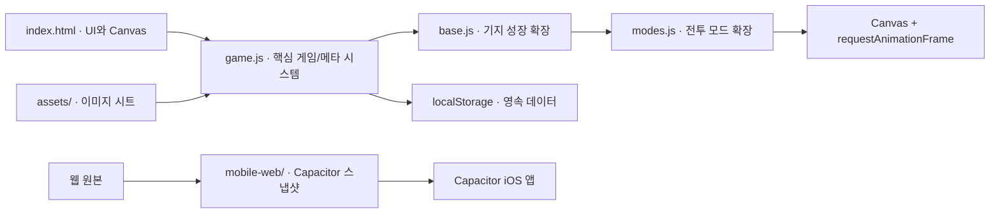

## 런타임 구성

## 파일 책임

| 파일 | 책임 |
| --- | --- |
| `index.html` | Canvas, 메뉴, HUD, 모달 DOM과 스크립트 로드 순서 |
| `style.css` | 데스크톱/모바일 UI, 카드, 스프라이트 시트 표현 |
| `game.js` | 상태, 전투 루프, 렌더링, 무기/스킬, 장비, 상점, 퀘스트 |
| `base.js` | 기지 시설, 복구 진행도, 전투 보너스 |
| `modes.js` | 정복/무한/보스 러시 규칙과 루프 확장 |
| `mobile-web/` | Capacitor의 `webDir`이 가리키는 배포 스냅샷 |

## 중요한 결합 지점

모든 스크립트는 ES 모듈이 아닌 전역 스코프에서 실행된다. `base.js`와 `modes.js`는 `begin`, `end`, `spawnEnemy`, `update`, `draw` 같은 함수를 저장한 뒤 다시 할당해 기능을 확장한다. 따라서 `index.html`의 로드 순서는 공개 API와 같다.

<Warning>
  전역 함수를 이름 변경하거나 시그니처를 바꾸면 뒤 스크립트의 래퍼도 반드시 함께 수정해야 한다.
</Warning>

렌더링은 하나의 루프만 있는 구조가 아니다. 핵심 `draw`/`update` 외에도 여러 `requestAnimationFrame` 루프가 스킬, 텍스처, 적 행동과 오버레이를 담당한다. 새 루프를 추가할 때는 `run`, `paused`, `player` 존재 여부를 확인하고 프레임 시간 상한을 둔다.
