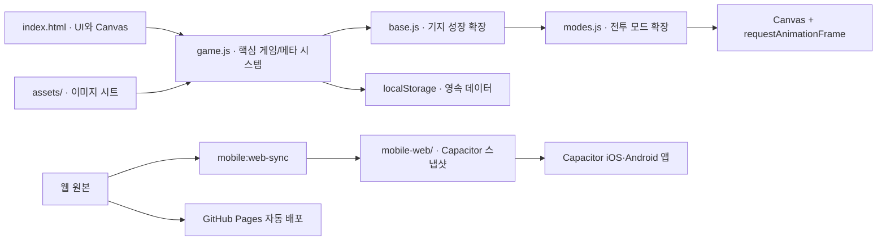

## 런타임 구성

## 파일 책임

| 파일 | 책임 |
| --- | --- |
| `index.html` | Canvas, 메뉴, HUD, 모달 DOM과 스크립트 로드 순서 |
| `style.css` | 데스크톱/모바일 UI, 카드, 스프라이트 시트 표현 |
| `game.js` | 상태, 전투 루프, 렌더링, 무기/스킬, 장비, 상점, 퀘스트 |
| `base.js` | 기지 시설, 복구 진행도, 전투 보너스 |
| `modes.js` | 정복/무한/보스 러시 규칙과 루프 확장 |
| `characters.js` | 요원 데이터, Q/E/R/F 입력·쿨타임, 궁극기·초월기 충전, 기간 한정 이벤트와 요원 전용 투사체·영역 효과 |
| `mobile-web/` | Capacitor의 `webDir`이 가리키는 배포 스냅샷 |
| `sw.js` | 웹 배포에서 최신 파일을 우선 요청하고 오프라인 시 캐시를 사용하는 서비스 워커 |
| `scripts/sync-mobile.mjs` | 웹 원본과 에셋을 `mobile-web/`에 동기화 |
| `scripts/build-pages.mjs` | GitHub Pages 배포용 `_site/` 생성 |

## 중요한 결합 지점

모든 스크립트는 ES 모듈이 아닌 전역 스코프에서 실행된다. `base.js`, `modes.js`, `characters.js`는 `begin`, `end`, `spawnEnemy`, `update`, `draw` 같은 함수를 저장한 뒤 다시 할당해 기능을 확장한다. 따라서 `index.html`의 로드 순서는 공개 API와 같다. 요원 시스템은 기존 확장이 준비된 뒤 실행되므로 항상 마지막에 로드한다.

<Warning>
  전역 함수를 이름 변경하거나 시그니처를 바꾸면 뒤 스크립트의 래퍼도 반드시 함께 수정해야 한다.
</Warning>

렌더링은 하나의 루프만 있는 구조가 아니다. 핵심 `draw`/`update` 외에도 여러 `requestAnimationFrame` 루프가 스킬, 텍스처, 적 행동과 오버레이를 담당한다. 새 루프를 추가할 때는 `run`, `paused`, `player` 존재 여부를 확인하고 프레임 시간 상한을 둔다.

## 특별 요원 컬렉션

`characters.js`의 `ANIMATION_STYLE_EVENT`와 `BLADE_FANTASY_EVENT`는 각각 초월자 격돌과 월광 검객 컬렉션을 정의한다. 두 컬렉션은 일정과 관계없이 상시 획득 가능하며 `operativeRoster`, `operativeRanks`, 선택 요원 데이터 구조를 그대로 사용한다.

요원 상자의 초월 확률은 1%로 고정된다. 기존 초월 풀이 0.5%, 두 특별 컬렉션이 각각 0.25%를 사용한다. 월광 검객 컬렉션의 `StanceController`와 `CounterWindow`는 자세와 단발 반격 창을 공통 상태 객체로 관리한다.

일반~전설 신규 요원은 `LOWER_RARITY_CHARACTER_CONFIG`에 정의한다. 반사 투사체, 발판, 실 함정, 거품 영역, 씨앗 포탑과 극성 파편은 `lowerWorld`의 종류별 제한 배열에서 관리하며, `makePlayer`와 `end` 래퍼가 전투 경계에서 이를 정리한다. 이 요원들은 기존 Q/E/R 입력만 사용하고 초월 F UI는 숨긴다.
